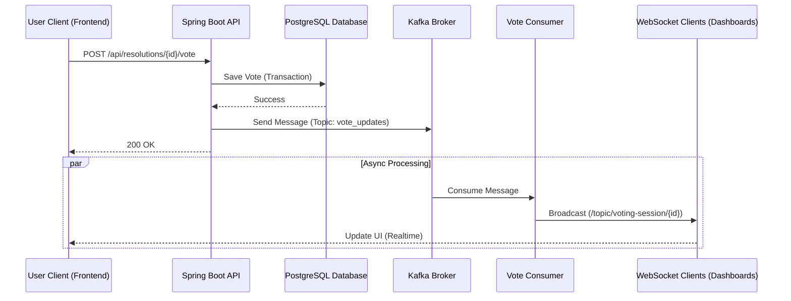

# Tài Liệu Tích Hợp Kafka & Voting Flow

Tài liệu này mô tả chi tiết quy trình xử lý phiếu bầu sử dụng **Apache Kafka** làm trung gian xử lý sự kiện (Event-Driven Architecture) để đảm bảo tính Real-time và khả năng mở rộng.

## 1. Tổng Quan Luồng Dữ Liệu (Architecture Overview)

Quy trình tổng thể khi một User thực hiện bỏ phiếu:



## 2. Chi Tiết Triển Khai

### 2.1. API Endpoint (Producer Trigger)

Khi người dùng gọi API bỏ phiếu, hệ thống sẽ thực hiện lưu dữ liệu và kích hoạt Producer.

*   **Endpoint**: `POST /api/resolutions/{resolutionId}/vote`
*   **Service Method**: `VotingService.castVote(...)`
*   **Logic**:
    1.  Validate request & User permission.
    2.  Lưu/Cập nhật entity `Vote` vào Database.
    3.  Lưu `VoteLog`.
    4.  Tính toán kết quả hiện tại (`getVotingResults`).
    5.  Gửi kết quả tính toán vào Kafka.

### 2.2. Kafka Message Structure

Dữ liệu được gửi vào Kafka Topic `vote_updates` là **kết quả tổng hợp của cả cuộc họp (Meeting)** bao gồm danh sách Biểu quyết (Resolutions) và Bầu cử (Elections).

*   **Topic**: `vote_updates` (hoặc `meeting_updates`)
*   **Key**: `meetingId`
*   **Payload Class**: `MeetingRealtimeStatus`

**Ví dụ Payload JSON:**

```json
{
  "meetingId": "MEETING_001",
  "resolutionResults": [
    {
      "resolutionId": "RES_001",
      "resolutionTitle": "Thông qua báo cáo tài chính",
      "results": [
        { "votingOptionName": "Đồng ý", "voteCount": 100, "percentage": 90.0 },
        { "votingOptionName": "Không đồng ý", "voteCount": 10, "percentage": 10.0 }
      ]
    }
  ],
  "electionResults": [
     {
      "electionId": "ELECTION_001",
      "electionTitle": "Bầu thành viên HĐQT",
      "results": [
        { "votingOptionName": "Nguyen Van A", "voteCount": 80, "percentage": 50.0 },
        { "votingOptionName": "Tran Van B", "voteCount": 70, "percentage": 43.75 }
      ]
    }
  ]
}
```

### 2.3. Kafka Consumer

Service `VoteConsumer` lắng nghe liên tục trên topic `vote_updates`.

*   **Group ID**: `voting-group`
*   **Logic**:
    1.  Nhận message `MeetingRealtimeStatus`.
    2.  Trích xuất `meetingId`.
    3.  Đẩy dữ liệu này vào kênh WebSocket của cuộc họp.

### 2.4. WebSocket Integration (Realtime Display)

Hệ thống sử dụng **STOMP over WebSocket** để broadcast dữ liệu xuống Client.

*   **WebSocket Endpoint**: `/ws`
*   **Subscription Topic**: `/topic/meeting/{meetingId}`

**Client (Frontend) Integration:**

Frontend cần Subscribe vào topic của Meeting để nhận cập nhật toàn bộ.

```javascript
// Kết nối
var socket = new SockJS('/ws');
var stompClient = Stomp.over(socket);

stompClient.connect({}, function (frame) {
    // Subscribe theo Meeting ID
    stompClient.subscribe('/topic/meeting/MEETING_001', function (response) {
        var meetingStatus = JSON.parse(response.body);
        
        console.log("Resolutions:", meetingStatus.resolutionResults);
        console.log("Elections:", meetingStatus.electionResults);
        
        // Render Dashboard
        renderMeetingDashboard(meetingStatus);
    });
});
```

## 3. Cấu Hình Cần Thiết

Đảm bảo `application.properties` có đủ cấu hình:

```properties
# Kafka
spring.kafka.bootstrap-servers=localhost:9092
spring.kafka.consumer.group-id=voting-group
spring.kafka.template.default-topic=vote_updates

# WebSocket (Không cần config properties, chỉ cần WebSocketConfig class)
```
