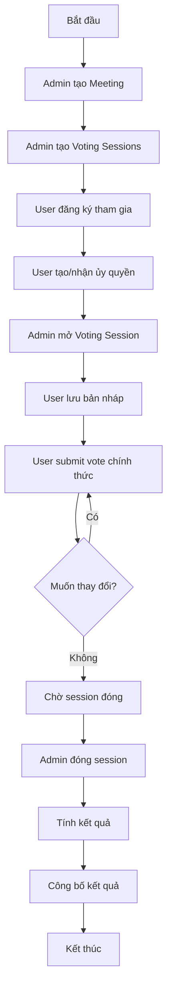

# Business Logic - Quy Trình Bỏ Phiếu

## Tổng Quan

Document này mô tả chi tiết quy trình bỏ phiếu trong hệ thống Đại Hội Cổ Đông, bao gồm các trạng thái, luồng xử lý, validation rules, và edge cases.

---

## 1. Các Loại Bỏ Phiếu

### 1.1. Biểu Quyết Nghị Quyết (RESOLUTION)
- **Mục đích**: Thông qua các nghị quyết, quyết định của đại hội
- **Lựa chọn**: 
  - Tán thành (Agree)
  - Không tán thành (Disagree)
  - Không ý kiến (Abstain)
- **Quy tắc**: Mỗi user chỉ chọn 1 trong 3 lựa chọn
- **Tính kết quả**: Theo tỷ lệ % và số cổ phần

### 1.2. Bầu Ban Kiểm Soát (SUPERVISORY_BOARD)
- **Mục đích**: Bầu các thành viên ban kiểm soát
- **Phương pháp**: Bỏ phiếu tích lũy (Cumulative Voting)
- **Quy tắc**: 
  - Tổng số phiếu = Số cổ phần
  - Ví dụ: User có 5,000 cổ phần → Tổng 5,000 phiếu
  - User phân bổ phiếu tự do cho các ứng viên
  - Có thể cho tất cả phiếu cho 1 người hoặc chia đều
- **Ví dụ phân bổ**:
  ```
  Tổng phiếu: 5,000
  - Ứng viên 1: 5,000 phiếu
  - Ứng viên 2: 10,000 phiếu
  - Ứng viên 3: 10,000 phiếu
  - Ứng viên 4: 0 phiếu
  - Ứng viên 5: 0 phiếu
  ```
- **Tính kết quả**: Top N ứng viên có tổng số phiếu cao nhất

### 1.3. Bầu Hội Đồng Quản Trị (BOARD_OF_DIRECTORS)
- **Mục đích**: Bầu các thành viên hội đồng quản trị
- **Phương pháp**: Bỏ phiếu tích lũy (Cumulative Voting)
- **Quy tắc**: Tương tự Ban Kiểm Soát
  - Tổng số phiếu = Số cổ phần
  - Phân bổ tự do cho các ứng viên
- **Tính kết quả**: Top N ứng viên có tổng số phiếu cao nhất

---

## 2. Quy Trình Bỏ Phiếu Chính Thức

### 2.1. Điều Kiện Tiên Quyết

@startuml
start
:User muốn bỏ phiếu;

if (Trong thời gian\nbỏ phiếu?) then (Không)
  :Từ chối - Ngoài thời gian;
  stop
else (Có)
  if (Đã bỏ phiếu\ntrước đó?) then (Có)
      :Cho phép thay đổi phiếu;
    else (Không)
      :Cho phép bỏ phiếu mới;
    endif
  endif
endif

stop
@enduml

### 2.2. Validation Rules

#### Rule 1: Thời gian hợp lệ
```
current_time >= meeting.voting_start_time 
AND 
current_time <= meeting.voting_end_time
```

#### Rule 2: Số lượng lựa chọn
```
number_of_selections <= meeting.candidates.size()
```

#### Rule 3: Quyền biểu quyết
```
vote_weight = user.shares_owned + SUM(delegated_shares)
```
- User vote với trọng số = số cổ phần của mình
- Nếu được ủy quyền, cộng thêm số cổ phần được ủy quyền

#### Rule 4: Ứng viên hợp lệ
```
candidate.voting_session_id = current_voting_session.id
```

### 2.3. Luồng Xử Lý Bỏ Phiếu

@startuml
participant User as U
participant "API Server" as API
participant Database as DB
participant "Vote Log" as Log
participant Notification as Notif

U -> API: POST /meetings/{id}/vote
activate API

API -> API: Validate time window
API -> API: Check user participation
API -> DB: Check existing vote
activate DB

alt User đã vote trước đó
    DB --> API: Return existing vote
    API -> API: Validate can change
    API -> DB: Update vote
    API -> Log: Log VOTE_CHANGED
    activate Log
    deactivate Log
else User chưa vote
    API -> DB: Create new vote
    API -> Log: Log VOTE_CAST
    activate Log
    deactivate Log
end

deactivate DB

API -> DB: Delete draft (if exists)
API -> Notif: Send confirmation
activate Notif
deactivate Notif

API --> U: Return success
deactivate API

@enduml

### 2.4. Các Bước Chi Tiết

#### Bước 1: Validate Request
```java
// Pseudo code
validateVoteRequest(meetingId, userId, candidateIds) {
    // 1. Check meeting exists
    meeting = findMeeting(meetingId)
    
    // 2. Check time window
    now = getCurrentTime()
    if (meeting.votingStartTime != null && now < meeting.votingStartTime) {
        throw "Outside voting time window"
    }
    if (meeting.votingEndTime != null && now > meeting.votingEndTime) {
        throw "Outside voting time window"
    }
    
    // 3. Check user availability (All users in DB are eligible)
    user = findUser(userId)
    if (user == null || !user.enabled) {
        throw "User is not active or not found"
    }
    
    // 4. Check number of selections
    if (candidateIds.length > candidates.size()) {
        throw "Too many selections"
    }
    
    // 5. Validate all candidates belong to this session
    for (candidateId in candidateIds) {
        candidate = findCandidate(candidateId)
        if (candidate.votingSessionId != sessionId) {
            throw "Invalid candidate for this session"
        }
    }
}
```

#### Bước 2: Calculate Vote Weight
```java
calculateVoteWeight(userId, meetingId) {
    user = findUser(userId)
    baseWeight = user.sharesOwned
    
    // Check if user has delegated shares
    delegations = findActiveDelegations(meetingId, proxyId: userId)
    delegatedWeight = SUM(delegations.sharesDelegated)
    
    totalWeight = baseWeight + delegatedWeight
    return totalWeight
}
```

#### Bước 3: Process Vote

**Cho RESOLUTION:**
```java
processResolutionVote(sessionId, userId, candidateId) {
    voteWeight = calculateVoteWeight(userId, session.meetingId)
    
    // Xóa vote cũ nếu có
    deleteExistingVotes(sessionId, userId)
    
    // Tạo vote mới
    vote = createVote({
        votingSessionId: sessionId,
        userId: userId,
        candidateId: candidateId,
        voteWeight: voteWeight,  // Toàn bộ cổ phần
        votedAt: now()
    })
    
    logVoteAction({
        userId: userId,
        action: VOTE_CAST,
        candidateId: candidateId
    })
}
```

**Cho BOD và SUPERVISORY_BOARD (Cumulative Voting):**
```java
processCumulativeVote(sessionId, userId, voteDistribution) {
    // voteDistribution = { candidateId: voteCount, ... }
    // Ví dụ: { 1: 5000, 2: 10000, 3: 10000 }
    
    // 1. Tính tổng số phiếu được phép
    baseShares = calculateVoteWeight(userId, session.meetingId)
    totalAllowedVotes = baseShares
    
    // 2. Validate tổng phiếu phân bổ
    totalAllocated = SUM(voteDistribution.values())
    if (totalAllocated > totalAllowedVotes) {
        throw "Total votes allocated exceeds allowed votes"
    }
    
    // 3. Validate mỗi phiếu không âm
    for (candidateId, voteCount in voteDistribution) {
        if (voteCount < 0) {
            throw "Vote count cannot be negative"
        }
        if (voteCount > totalAllowedVotes) {
            throw "Vote count for single candidate exceeds total allowed"
        }
    }
    
    // 4. Xóa tất cả votes cũ
    existingVotes = findVotes(sessionId, userId)
    deleteVotes(existingVotes)
    
    // 5. Tạo votes mới cho từng ứng viên
    for (candidateId, voteCount in voteDistribution) {
        if (voteCount > 0) {  // Chỉ tạo nếu có phiếu
            vote = createVote({
                votingSessionId: sessionId,
                userId: userId,
                candidateId: candidateId,
                voteWeight: voteCount,  // Số phiếu phân bổ cho ứng viên này
                isProxyVote: hasProxyDelegation(userId),
                votedAt: now()
            })
            
            logVoteAction({
                userId: userId,
                votingSessionId: sessionId,
                voteId: vote.id,
                action: VOTE_CAST,
                candidateId: candidateId,
                metadata: {
                    voteCount: voteCount,
                    totalAllowed: totalAllowedVotes
                }
            })
        }
    }
    
    // 6. Delete draft if exists
    deleteDrafts(sessionId, userId)
    
    // 7. Send notification
    sendNotification(userId, {
        message: "Vote submitted successfully",
        totalVotes: totalAllocated,
        allowedVotes: totalAllowedVotes
    })
}
```

---

## 3. Quy Trình Lưu Bản Nháp

### 3.1. Mục Đích
- Cho phép user lưu lựa chọn tạm thời
- Tránh mất dữ liệu khi chưa quyết định chắc chắn
- Có thể xem lại và chỉnh sửa trước khi submit chính thức

### 3.2. Luồng Xử Lý

@startuml
start

:User chọn ứng viên;

if (Muốn lưu nháp?) then (Có)
  :POST /voting-sessions/{id}/draft;
  
  if (Draft đã tồn tại?) then (Có)
    :Update draft;
  else (Không)
    :Create new draft;
  endif
  
  :Lưu thành công;
  stop
  
else (Không)
  if (Muốn submit?) then (Có)
    :POST /voting-sessions/{id}/vote;
    :Xóa draft tự động;
    :Tạo vote chính thức;
    stop
  else (Không)
    stop
  endif
endif

@enduml

### 3.3. Business Rules cho Draft

#### Rule 1: Draft không ảnh hưởng kết quả
- Draft chỉ là bản lưu tạm
- Không được tính vào kết quả vote

#### Rule 2: Draft tự động xóa
- Khi user submit vote chính thức
- Khi voting session đóng (status = CLOSED)
- Khi voting session bị xóa

#### Rule 3: User có thể có nhiều drafts
- Mỗi draft cho 1 candidate khác nhau
- Unique constraint: (voting_session_id, user_id, candidate_id)

#### Rule 4: Draft có thể có notes
- User ghi chú cá nhân
- Không public, chỉ user nhìn thấy

### 3.4. API cho Draft

**Cho RESOLUTION:**
```java
// Save draft
POST /api/meetings/{id}/draft
{
    "candidateId": 123,
    "notes": "Cân nhắc lựa chọn này"
}
```

**Cho BOD và SUPERVISORY_BOARD (Cumulative Voting):**
```java
// Save draft with vote distribution
POST /api/meetings/{id}/draft
{
    "voteDistribution": {
        "1": 5000,    // candidate_id: vote_count
        "2": 10000,
        "3": 10000
    },
    "notes": "Phân bổ tạm thời, cần xem xét thêm"
}

// Response
{
    "draftId": 456,
    "totalVotesAllocated": 25000,
    "totalVotesAllowed": 25000,
    "remainingVotes": 0,
    "savedAt": "2026-01-07T00:00:00Z"
}
```

**Common APIs:**
```java
// Get user's drafts
GET /api/meetings/{id}/drafts

// Response for cumulative voting
{
    "drafts": [
        {
            "draftId": 456,
            "voteDistribution": {
                "1": 5000,
                "2": 10000,
                "3": 10000
            },
            "totalAllocated": 25000,
            "totalAllowed": 25000,
            "notes": "...",
            "updatedAt": "2026-01-07T00:00:00Z"
        }
    ]
}

// Delete draft
DELETE /api/drafts/{draftId}

// Convert draft to vote
POST /api/meetings/{id}/vote-from-draft
{
    "draftId": 456
}
```

---

## 4. Quy Trình Ủy Quyền (Proxy Voting)

### 4.1. Tạo Ủy Quyền

@startuml
start

:User A muốn ủy quyền;
:Chọn người được ủy quyền B;

if (B đã đăng ký\ntham gia meeting?) then (Không)
  :Từ chối - B phải đăng ký trước;
  stop
else (Có)
  if (A đã ủy quyền\ncho người khác?) then (Có)
    :Từ chối - Chỉ ủy quyền cho 1 người;
    stop
  else (Không)
    :Tạo proxy delegation;
    :Upload giấy ủy quyền;
    :Status = ACTIVE;
    stop
  endif
endif

@enduml

### 4.2. Validation Rules

#### Rule 1: Một người chỉ ủy quyền cho một người
```sql
UNIQUE(meeting_id, delegator_id)
```

#### Rule 2: Số cổ phần ủy quyền hợp lệ
```java
shares_delegated <= delegator.shares_owned
```

#### Rule 3: Người được ủy quyền phải là user hợp lệ
```java
exists(users WHERE id = proxy_id AND enabled = true)
```

### 4.3. Quyền Biểu Quyết của Proxy

```java
// User B được A ủy quyền
calculateProxyVotingPower(userId, meetingId) {
    // Cổ phần của chính B
    ownShares = user.sharesOwned
    
    // Cổ phần được ủy quyền từ A
    delegations = findActiveDelegations(meetingId, proxyId: userId)
    delegatedShares = SUM(delegations.sharesDelegated)
    
    totalPower = ownShares + delegatedShares
    
    return {
        ownShares: ownShares,
        delegatedShares: delegatedShares,
        totalPower: totalPower,
        delegators: delegations.map(d => d.delegator)
    }
}
```

### 4.4. Vote với Proxy

Khi user B (được ủy quyền) bỏ phiếu:

```java
processProxyVote(sessionId, proxyUserId, candidateId) {
    // 1. Tính tổng quyền biểu quyết
    votingPower = calculateProxyVotingPower(proxyUserId, meetingId)
    
    // 2. Tạo vote với trọng số tổng
    vote = createVote({
        votingSessionId: sessionId,
        userId: proxyUserId,
        candidateId: candidateId,
        voteWeight: votingPower.totalPower,
        isProxyVote: true,
        proxyFromUserId: null  // Hoặc lưu list delegators
    })
    
    // 3. Log chi tiết
    logVoteAction({
        userId: proxyUserId,
        action: VOTE_CAST,
        metadata: {
            ownShares: votingPower.ownShares,
            delegatedShares: votingPower.delegatedShares,
            delegators: votingPower.delegators
        }
    })
}
```

### 4.5. Thu Hồi Ủy Quyền

@startuml
start

:User A muốn thu hồi;

if (Voting đã bắt đầu?) then (Có)
  :Từ chối - Không thể thu hồi\nkhi đang vote;
  stop
else (Không)
  :Update status = REVOKED;
  :Set revoked_at = now;
  :Thông báo cho B;
  stop
endif

@enduml

**Rule**: Chỉ thu hồi được trước khi voting session bắt đầu

---

## 5. Tính Kết Quả

### 5.1. Kết Quả Biểu Quyết (RESOLUTION)

```java
calculateResolutionResult(sessionId) {
    votes = findAllVotes(sessionId)
    
    results = {
        agree: {
            count: 0,
            weight: 0,
            percentage: 0
        },
        disagree: {
            count: 0,
            weight: 0,
            percentage: 0
        },
        abstain: {
            count: 0,
            weight: 0,
            percentage: 0
        }
    }
    
    totalWeight = 0
    
    for (vote in votes) {
        candidate = vote.candidate
        results[candidate.name].count += 1
        results[candidate.name].weight += vote.voteWeight
        totalWeight += vote.voteWeight
    }
    
    // Calculate percentages
    for (option in results) {
        results[option].percentage = 
            (results[option].weight / totalWeight) * 100
    }
    
    // Determine outcome
    if (results.agree.percentage > 50) {
        outcome = "PASSED"
    } else {
        outcome = "REJECTED"
    }
    
    return {
        results: results,
        totalVotes: votes.length,
        totalWeight: totalWeight,
        outcome: outcome
    }
}
```

### 5.2. Kết Quả Bầu Cử (BOARD/SUPERVISORY) - Cumulative Voting

```java
calculateElectionResult(sessionId) {
    votes = findAllVotes(sessionId)
    session = findVotingSession(sessionId)
    
    candidateResults = {}
    
    // Aggregate votes by candidate
    // Với cumulative voting, mỗi vote có voteWeight riêng
    for (vote in votes) {
        candidateId = vote.candidateId
        
        if (!candidateResults[candidateId]) {
            candidateResults[candidateId] = {
                candidate: vote.candidate,
                totalVotes: 0,        // Tổng số phiếu nhận được
                voterCount: 0,        // Số người bỏ phiếu
                voters: []
            }
        }
        
        // Cộng dồn số phiếu (voteWeight)
        candidateResults[candidateId].totalVotes += vote.voteWeight
        candidateResults[candidateId].voterCount += 1
        candidateResults[candidateId].voters.push({
            userId: vote.userId,
            votesGiven: vote.voteWeight
        })
    }
    
    // Sort by total votes (descending)
    sortedResults = sortBy(candidateResults, 'totalVotes', 'DESC')
    
    // Determine winners (top N)
    winners = sortedResults;
    
    // Calculate statistics
    totalVotesCast = SUM(candidateResults.map(r => r.totalVotes))
    uniqueVoters = DISTINCT(votes.map(v => v.userId)).length
    
    return {
        allResults: sortedResults.map(r => ({
            candidate: r.candidate,
            totalVotes: r.totalVotes,
            voterCount: r.voterCount,
            percentage: (r.totalVotes / totalVotesCast) * 100
        })),
        winners: winners,
        statistics: {
            totalVotesCast: totalVotesCast,
            uniqueVoters: uniqueVoters
        }
    }
}
```

**Ví dụ Kết Quả:**
```json
{
    "allResults": [
        {
            "candidate": {
                "id": 2,
                "name": "Nguyễn Văn B"
            },
            "totalVotes": 45000,
            "voterCount": 3,
            "percentage": 36.0
        },
        {
            "candidate": {
                "id": 3,
                "name": "Trần Thị C"
            },
            "totalVotes": 40000,
            "voterCount": 4,
            "percentage": 32.0
        },
        {
            "candidate": {
                "id": 1,
                "name": "Lê Văn A"
            },
            "totalVotes": 30000,
            "voterCount": 5,
            "percentage": 24.0
        },
        {
            "candidate": {
                "id": 4,
                "name": "Phạm Văn D"
            },
            "totalVotes": 10000,
            "voterCount": 2,
            "percentage": 8.0
        }
    ],
    "winners": [
        // Top 3 nếu max_selections = 3
        { "candidate": {...}, "totalVotes": 45000 },
        { "candidate": {...}, "totalVotes": 40000 },
        { "candidate": {...}, "totalVotes": 30000 }
    ],
    "statistics": {
        "totalVotesCast": 125000,
        "uniqueVoters": 5
    }
}
```

---

## 6. Trạng Thái và Lifecycle

@startuml
[*] --> PENDING : Tạo mới
PENDING --> ACTIVE : Admin mở cuộc họp
ACTIVE --> CLOSED : Kết thúc cuộc họp
CLOSED --> [*]
@enduml

### 6.2. Vote Lifecycle

@startuml
[*] --> Draft : User lưu nháp
Draft --> Draft : User cập nhật nháp
Draft --> Submitted : User submit
Draft --> [*] : Session đóng (auto delete)

[*] --> Submitted : User vote trực tiếp
Submitted --> Submitted : User thay đổi vote
Submitted --> [*] : Session đóng (keep for history)
@enduml

---

## 7. Edge Cases và Xử Lý

### 7.1. User Vote Đúng Lúc Session Đóng

**Scenario**: User submit vote đúng lúc admin đóng session

**Solution**:
```java
// Use database transaction with lock
@Transactional
processVote(sessionId, userId, candidateIds) {
    session = findVotingSessionWithLock(sessionId)
    
    if (session.status != ACTIVE) {
        throw "Session is closed"
    }
    
    // Process vote...
    
    // Transaction commits only if session still ACTIVE
}
```

### 7.2. Proxy Vote Sau Khi Delegator Đã Vote

**Scenario**: 
1. User A ủy quyền cho B
2. A tự vote trước khi B vote
3. B vote sau đó

**Solution**:
```java
// Check if delegator has voted
validateProxyVote(proxyUserId, meetingId) {
    delegations = findActiveDelegations(meetingId, proxyId: proxyUserId)
    
    for (delegation in delegations) {
        delegatorVotes = findVotes(sessionId, delegation.delegatorId)
        
        if (delegatorVotes.isNotEmpty()) {
            // Delegator đã vote, không tính cổ phần ủy quyền
            delegation.effectiveShares = 0
        } else {
            delegation.effectiveShares = delegation.sharesDelegated
        }
    }
    
    return delegations
}
```

**Rule**: Nếu người ủy quyền đã vote, cổ phần ủy quyền không còn hiệu lực

### 7.3. Thay Đổi Vote Nhiều Lần

**Scenario**: User thay đổi vote liên tục

**Solution**:
- Cho phép thay đổi không giới hạn trong thời gian vote
- Log tất cả thay đổi vào `vote_logs`
- Chỉ vote cuối cùng được tính

### 7.4. Session Kết Thúc Đột Ngột

**Scenario**: Admin đóng session sớm

**Solution**:
```java
closeVotingSession(sessionId) {
    // 1. Update status
    updateStatus(sessionId, CLOSED)
    
    // 2. Delete all drafts
    deleteDrafts(sessionId)
    
    // 3. Finalize results
    results = calculateResults(sessionId)
    
    // 4. Send notifications
    sendNotificationToAllParticipants(
        "Voting session closed. Results available."
    )
    
    // 5. Lock votes (prevent further changes)
    lockVotes(sessionId)
}
```

---

## 8. Logging và Audit Trail

### 8.1. Vote Log

Mỗi hành động vote được log:

```java
{
    "userId": 123,
    "votingSessionId": 456,
    "voteId": 789,
    "action": "VOTE_CAST",  // or VOTE_CHANGED, VOTE_DELETED
    "candidateId": 111,
    "previousCandidateId": null,
    "ipAddress": "192.168.1.1",
    "userAgent": "Mozilla/5.0...",
    "timestamp": "2026-01-06T23:55:00Z"
}
```

### 8.2. Notification Log

Thông báo gửi đến user:

```java
{
    "userId": 123,
    "type": "IN_APP",
    "subject": "Vote Submitted",
    "content": "Your vote has been recorded successfully",
    "relatedEntityType": "VOTING_SESSION",
    "relatedEntityId": 456,
    "status": "DELIVERED",
    "sentAt": "2026-01-06T23:55:01Z"
}
```

---

## 9. Security Considerations

### 9.1. Vote Privacy
- Vote của user là **bí mật**
- Chỉ admin có thể xem kết quả tổng hợp
- User chỉ xem được vote của chính mình

### 9.2. Prevent Double Voting
- Unique constraint: (voting_session_id, user_id, candidate_id)
- Transaction isolation level: READ_COMMITTED

### 9.3. Audit Trail
- Tất cả hành động được log
- Không thể xóa log
- IP address và user agent được lưu

---

## 10. Performance Optimization

### 10.1. Caching
```java
// Cache voting session status
@Cacheable("voting-sessions")
getVotingSession(sessionId)

// Cache user voting power
@Cacheable("voting-power")
calculateVotingPower(userId, meetingId)
```

### 10.2. Database Indexes
- Index on (voting_session_id, user_id) for quick vote lookup
- Index on (meeting_id, user_id) for participant check
- Index on voting_session.status for filtering

### 10.3. Batch Processing
```java
// Calculate results in batch
calculateAllResults(meetingId) {
    sessions = findVotingSessions(meetingId)
    
    results = sessions.parallelStream()
        .map(session -> calculateResults(session.id))
        .collect(Collectors.toList())
    
    return results
}
```

---

## 11. Summary - Quy Trình Tổng Quát



---

## Kết Luận

Business logic của hệ thống bỏ phiếu được thiết kế với các nguyên tắc:

1. **Tính minh bạch**: Mọi hành động đều được log
2. **Tính linh hoạt**: Hỗ trợ nhiều loại vote, cho phép thay đổi
3. **Tính bảo mật**: Vote bí mật, có audit trail
4. **Tính chính xác**: Validation chặt chẽ, tránh lỗi
5. **Tính tiện dụng**: Hỗ trợ draft, ủy quyền, thông báo

Hệ thống đảm bảo quy trình bỏ phiếu diễn ra công bằng, minh bạch và hiệu quả.
